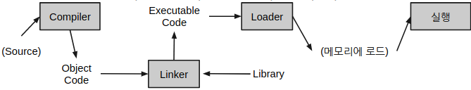

# Programming

## Motivation

### 컴퓨터를 이용한 문제 해결 과정.

1. 문제 정의 와 분석
2. Algorithm 고안.
   * Algorithm : 문제 해결 방법에 대한 단계적 풀이과정을 기술한 것.
3. Program 작성.
   * Algorithm을 컴퓨터가 수행할 수 있도록 컴퓨터가 이해 가능한 언어(Programming language)로 기술한 것.

## Difinition

컴퓨터가 **문제해결**을 하도록
* **Programming language**로
* 해당 문제 해결을 위한 **algorithm을 작성**하는 과정.
   * Algorithm 작성(고안) : 문제해결 방법을 작성, 고안하는 단계(컴퓨터의 특성을 반영하여 작성해야 함)
   * Coding : Algorithm을 컴퓨터가 이해하고 실행할 수 있도록 Programming Language로 작성(or 번역)하는 작업.

> Programming은 **algorithm작성** + **coding** 으로 구성된다고 할 수 있음.

### Algorithm

* Definition : 문제 해결 방법에 대한 단계적 풀이과정을 기술한 것.
* **algorithm작성** 이란, 컴퓨터를 이용하여 어떤 문제를 처리하도록, **문제해결과정**을 단계별로 작성하는 것.
* **flow-chart**가 **algorithm**을 작성하거나 표현하는데 많이 사용됨.

> Algorithm의 조건
>
> * input : 외부에서 제공하는 data가 1개 이상 존재해야 함.
> * output : 산출하는 결과가 적어도 1개 이상 존재해야 함. 
> * 명확성 : 각 처리 과정의 **명확**하게 제시되어야 함.
> * 유한성 : 일정단계 혹은 시간의 처리과정을 수행한 후 반드시 **종료**되어야 함.
> * 수행가능성 : 모든 단계 혹은 단계를 구성하는 명령어들은 현실적으로 수행가능해야함.

#### Algorithm의 표현

* Natural Language (자연어) 표현 방법.
   * 표현하기는 쉽지만 자연어가 사람들에 따라서 서로 다르게 이해될 수 있음.
   * 즉, algorithm을 **명확**하게 표현하기 어려움.
* Pseudo code 표현 방법  
   * 특정한 프로그래밍 언어가 갖는 어려운 문법이나 지식이 없어도 프로그램의 흐름을 알기 쉽도록 표현한 방법.
* Flow-chart 표현 방법 : 
   * 미리 정의된 symbol등을 이용하여 그림 형태로 알고리즘을 표현.
* 프로그래밍 언어 표현 방법 : 
   * 프로그래밍 언어를 이용하여 알고리즘의 의미를 표현하는 것
   * 컴퓨터를 이용하여 즉시 실행할 수 있음

### Programming Language

* 어떤 주어진 **문제를 해결**하기 위해, 
* 인간과 컴퓨터 사이에서 **의사 소통을 가능**케 하는 **인공**적인 언어.
   * 자연어 와 달리 **미리 정해진 규칙**에 따라 **엄격하게 정의**됨.
   * **compiler**나 **interpreter** 등을 통해 컴퓨터(기계)가 수행할 수 있는 **기계어**로 변환되어 수행됨.

> 컴퓨터가 이해할 수 있는**program**의 표현 방식 : Programming language (C, Python, and so on)

#### Programming Language 분류

* 기계 친화적인지 아니면 인간 친화적인지로 분류 : Abstraction의 수준에 의한 분류.
   * Low-level language : 기계어, Assembly language
      * 컴퓨터 H/W 내의 물리적 동작을 이해하고, 각 동작에 대응하는 명령어를 이용하여 프로그래밍.
      * H/W에 대한 지식이 매우 많이 요구됨.
      * 기계가 이해하기 쉬워서 빠른 동작이 가능하나 사람은 이해가 매우 어려움.
   * High-level languagae : C, Java, Python, C++
      * 사람이 이해하기 쉬운 언어.
      * **Abstraction(추상화)**이라는 개념을 도입하여 **H/W에 대한 직접적 이해 없이도 프로그래밍**이 가능.
      * 기억장소의 address 대신 **변수명**으로 데이터를 기억장치에 쓰거나 읽을 수 있음.
      * Natural language의 단어나 표현을 이용하여 컴퓨터의 동작을 abstraction(추상화)
      * **하나의 표현**으로 **여러 기계어 코드의 동작을 지시**할 수 있음.
* 작성 기법에 따른 분류
   * 절차중심 언어 
   * 객체지향 언어
* 세대별 구분 
* 작동방식별 구분
   * Complier language
   * Interpreter language

##### Machine Language

* 1세대 (1950년대 초반)
* 근본적으로는 0,1로 구성됨
* target 장비 기종에 따라 같은 동작을 수행하게 하는 프로그래밍 표현이 다름. (호환성 X)
   * 1회용 프로그래밍.
* 처리속도 는 가장 빠르지만, 가독성이나 재사용성 등에서 최악.

##### Asembly Language

* 2세대
* Machine Language와 1:1로 대응되는 symbol로 구성. > **Menomonic language** (영어 기반의 기호 언어)
* 속도가 매우 빠른 편이며, 약간의 호환성도 갖춤(비교대상이 Machin Language).
* 80196 등의 micro-processor 혹은 firmware programming시 접할 수 있음.

##### High-level Language

* 3세대 이상. (4,5세대 정의는 상당히 추상적...)
* **기계독립적** 이라는 특징을 가지며, Natural language에 가까운 단어나 문장으로 구성되는 특징을 가짐.
* **Complier** 또는 **Interpreter**가 필요하여 기계 수행의 관점에서는 속도나 효율성이 떨어지지만, 재사용성 및 가독성이 높고, H/W관련 지식없이도 programming을 가능하게 해줌.

###### Compiler Language

* Compiler(고급언어를 기계어로 번역)를 사용하는 고급 언어.
* 프로그램 전체를 읽어들여 이를 **object code**(목적코드)로 바꿈.
* Compiler 능력에 따른 **optimization** 등이 가능.
* 한번 compile한 경우 빠르게 프로그램 전체 실행이 가능하나, 소스 변경시 전체를 다시 컴파일해야함.
* 종류
   * FORTRAN, Pascal, COBOL, Ada, **C**, **C++**

* linker는 library와 start-up code, 그리고 object code을 결합해서 excutable code를 생성(그림에서 start-up code빠짐)

###### Interpreter Language

* Interpreter(행, line 단위로 기계어로 번역)에 의해, line 단위로 컴파일 없이 실행되는 언어.
* Script language로도 불림.
* compile 없이 line 단위 실행이 가능하므로, 개발단계에서 **적은 양의 수정에 대한 결과를 쉽게 확인 가능**.
* 대화식 프로그래밍(interactive mode)이 가능하여 교육용으로 적합.
* 종류
   * **Python**, PHP, ASP, **Java Script**, Perl , SNOBOL

| Compiler | Intepreter |
|---:|---:|
|object code 생성|line별로 machine language로|
|program 단위로 작업 수행|line별로 작업 수행|
|실행파일을 만드는데 시간이 많이 걸림 | 번역속도 빠름 |
|실행 속도 빠름 | 실행속도 느림.|
|한번 compile이후에는 compiler필요 없음|수행을 위해서는 interpreter필요.|

## 기타

### Markup Language

* Tag 등을 이용하여 **데이터의 구조 및 표현 방식** 등을 기술하는 언어.
* 문서의 기본 정보에 추가적인 정보(문서를 어떻게 시각적으로 표현할 것인지 정보 혹은 문서내용의 구조에 대한 추가적 정보)를 덧붙여 제공하기 위한 언어.
* Tag(or node), Attribute, Content, Element로 구성.
* 분류
   * 순차적 마크업
       * 문서 내용을 시각적으로 어떻게 표현할 지에 대한 정보 제공.
       * 예> HTML, 워드프로세서 문서 파일.
   * 서술적 마크업
       * 문서 내용의 구조에 대한 추가적 정보 제공.
       * 예> SGML,XML, Latex

### Translation Program

* Preprocessor
   * 기호 변환 작업이나 Macro확장 등을 수행하며, 입출력 모두 고급언어.

* Cross Compiler
   * 이기종의 컴퓨터에서 실행가능한 object code 생성하는 컴파일러. 

